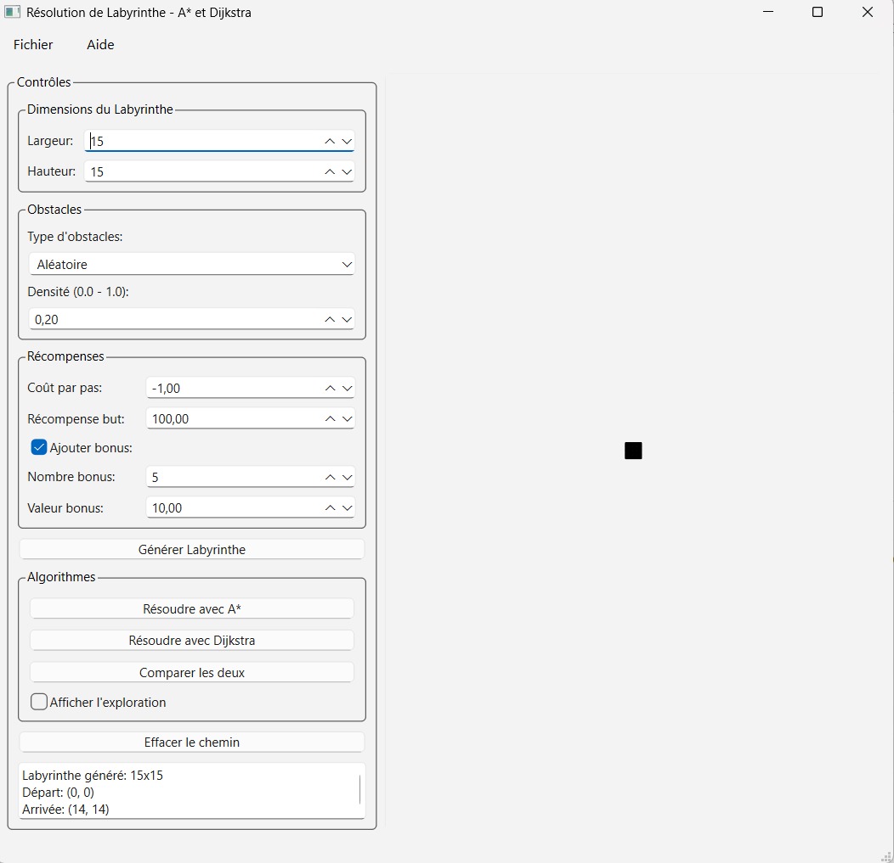
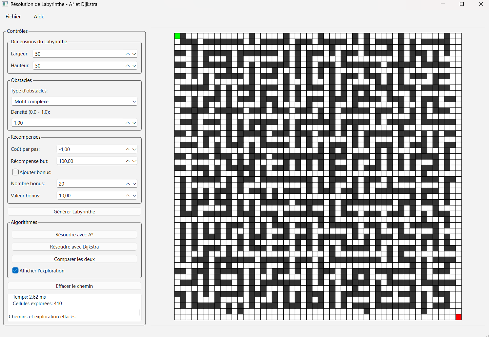
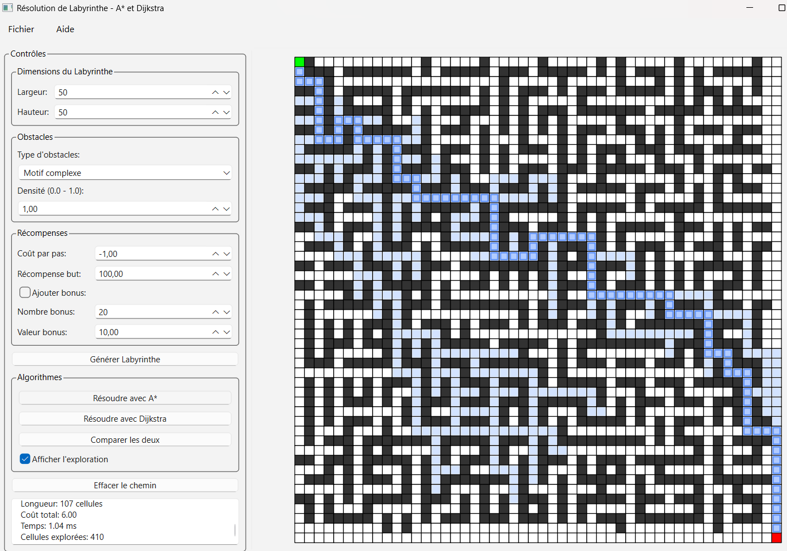
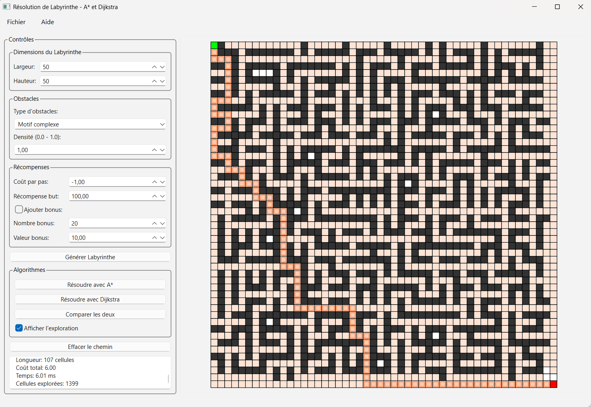
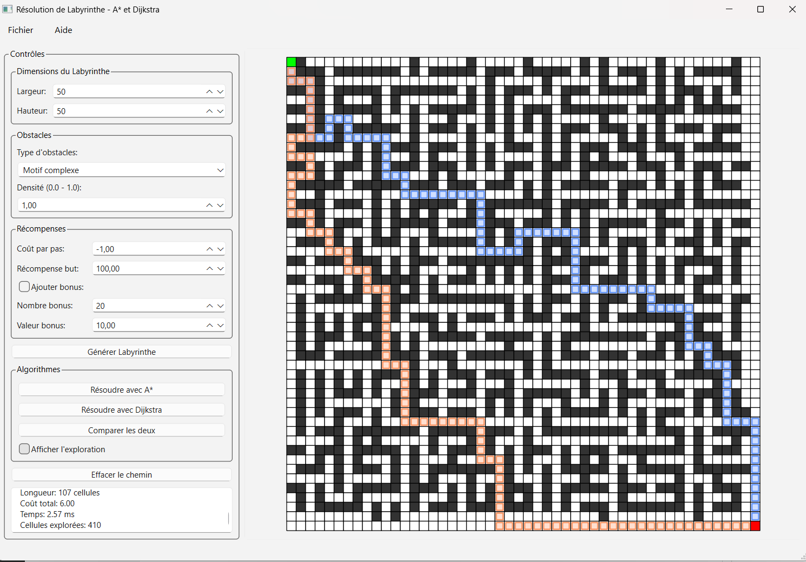
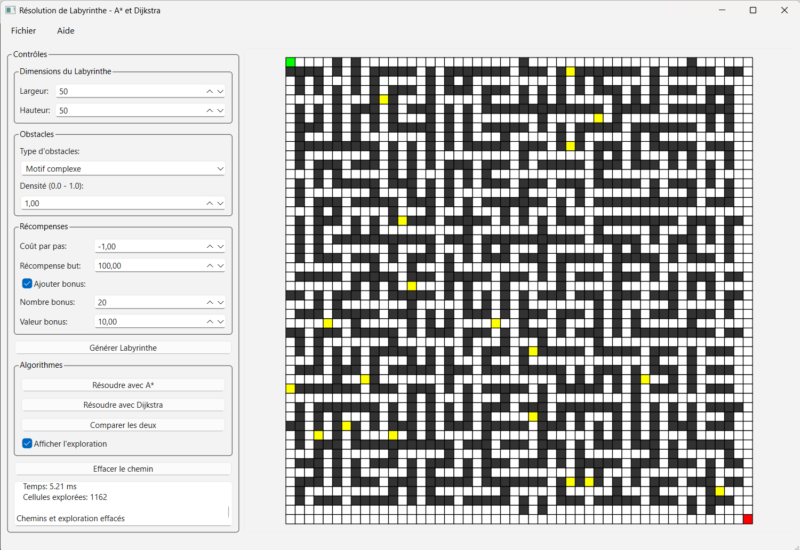
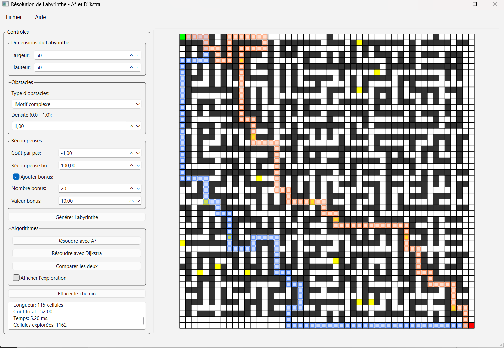

# TP1 - Robotique : Résolution de labyrinthe avec A*

**Nom :** Anas DAGGAG  
**Polytech Paris Saclay :** APP5 EIE  
**Date :** 12/02/2026  

---

## Introduction

Ce TP porte sur l'implémentation des algorithmes Dijkstra et A* pour résoudre des labyrinthes représentés sous forme de grilles 2D. L'objectif est de trouver le chemin optimal entre un point de départ et un point d'arrivée en présence d'obstacles et de récompenses.

Les fichiers principaux sont : `Maze.py` (algorithmes), `main.py` (génération), `app.py` (interface graphique), `tests.py` (validation).

---

## **PARTIE A : ÉCRIRE LA CLASSE MAZE**

La classe `Maze` a été implémentée dans `Maze.py` avec les méthodes suivantes : initialisation de la grille et des récompenses, vérification des cellules franchissables (`is_passable`), identification des voisins 4-connexes (`get_neighbors`), calcul de l'heuristique de Manhattan (`heuristic`), et gestion des obstacles et récompenses.

---

## **PARTIE B : FONCTIONS DE GÉNÉRATION**

Les fonctions de génération ont été implémentées dans `main.py` : `generate_random_obstacles()` pour obstacles aléatoires, `generate_deterministic_obstacles()` pour motifs prédéfinis (murs verticaux/horizontaux/complexe), `initialize_uniform_rewards()` pour matrice de récompenses, et `create_complete_maze()` pour création complète du labyrinthe.

---

## **PARTIE C : RÉSOLUTION AVEC A***

Les algorithmes A* et Dijkstra ont été implémentés dans les méthodes `solve()` et `solve_dijkstra()`. A* utilise f(n) = g(n) + h(n) avec l'heuristique de Manhattan. Dijkstra est un cas particulier de A* avec h(n) = 0. Les deux utilisent une file de priorité (heapq) et garantissent le chemin optimal.

---

## 1. Tests des labyrinthes sans et avec obstacles

**Question 1 : Tester un labyrinthe sans obstacle, un labyrinthe comportant des obstacles simples, ainsi qu'un cas où aucun chemin n'est possible. Il faudra également vérifier que les contraintes sur les cellules de départ et d'arrivée sont toujours respectées.**

### 1.1. Labyrinthe 10x10 sans obstacle

| Algorithme | Longueur chemin | Coût total | Temps (ms) |
|------------|-----------------|------------|------------|
| A* | 19 cellules | -82.00 | 1.02 |
| Dijkstra | 19 cellules | -82.00 | 0.53 |

Les deux algorithmes trouvent le même chemin optimal de (0,0) à (9,9). Dijkstra est 1.93x plus rapide sur cette petite grille.

### 1.2. Labyrinthe 10x10 avec obstacles (densité 0.2)

| Algorithme | Longueur chemin | Coût total | Temps (ms) |
|------------|-----------------|------------|------------|
| A* | 19 cellules | -82.00 | 0.31 |
| Dijkstra | 19 cellules | -82.00 | 0.21 |

Les obstacles sont correctement contournés. Même chemin trouvé par les deux algorithmes. Les cellules de départ et d'arrivée restent franchissables.

### 1.3. Labyrinthe sans solution

Un mur bloquant sur toute la ligne 5 rend le but inaccessible. Les deux algorithmes retournent `None` correctement sans lever d'erreur.

---

## 2. Extensions

**Question 2 : En extension, les étudiants pourront proposer l'ajout de déplacements diagonaux avec un coût adapté, une visualisation graphique du labyrinthe et du chemin.**

### 2.1. Déplacements diagonaux

Un module `DiagonalMaze` a été implémenté avec support de 8 directions (4 orthogonales + 4 diagonales). Le coût diagonal est √2 ≈ 1.414, et l'heuristique utilisée est la distance euclidienne.

**Résultats sur labyrinthe 10x10 sans obstacle :**

| Type de mouvement | Nombre de cellules | Coût total | Réduction |
|-------------------|-------------------|------------|------------|
| 4 directions | 19 cellules | -82.00 | - |
| 8 directions | 10 cellules | -130.09 | 47.4% |

Le chemin avec diagonales est 1.90x plus court. Le coût total augmente car chaque diagonal coûte √2 au lieu de 1.

### 2.2. Visualisation graphique

Interface PySide6 développée avec les fonctionnalités suivantes :
- Génération paramétrable de labyrinthes (dimensions 5-50, types d'obstacles, densités)
- Affichage coloré des chemins A* et Dijkstra
- Visualisation de l'exploration (cellules visitées)
- Comparaison des performances

**Figure 1 : Interface principale**


**Figure 2 : Labyrinthe 35x35 avec obstacles**


**Figure 3 : Exploration A* (bleu)**


**Figure 4 : Exploration Dijkstra (orange)**


A* explore 410 cellules contre 1399 pour Dijkstra, soit 70% de réduction.

**Figure 5 : Comparaison directe**


**Figure 6-7 : Chemins avec bonus (jaune)**



---

## 3. Comparaison Dijkstra et A*

**Question 3 : Faire une comparaison entre Dijkstra et A*.**

| Labyrinthe | Algorithme | Longueur | Coût | Temps (ms) | Ratio |
|------------|------------|----------|------|------------|-------|
| 10x10 sans obstacle | A* | 19 | -82.00 | 1.02 | - |
| 10x10 sans obstacle | Dijkstra | 19 | -82.00 | 0.53 | 1.93x |
| 10x10 avec obstacles | A* | 19 | -82.00 | 0.31 | - |
| 10x10 avec obstacles | Dijkstra | 19 | -82.00 | 0.21 | 1.48x |
| 12x8 murs verticaux | A* | 19 | -82.00 | 0.33 | 1.21x |
| 12x8 murs verticaux | Dijkstra | 19 | -82.00 | 0.39 | - |
| 30x30 complexe | A* | 63 | -54.00 | 0.36 | 5.63x |
| 30x30 complexe | Dijkstra | 63 | -54.00 | 2.02 | - |

**Observations :**

Les deux algorithmes trouvent toujours le chemin optimal. Sur petits labyrinthes (10x10), Dijkstra est plus rapide en raison de l'overhead du calcul d'heuristique. A* devient significativement plus performant sur grands labyrinthes (30x30 : 5.63x plus rapide) car l'heuristique réduit l'exploration.

---

## 4. Tests avec poids négatifs

**Question 4 : Testez les deux algorithmes avec des poids négatifs. Commentez les résultats.**

Dans l'implémentation, les récompenses positives diminuent le coût (bonus), les récompenses négatives l'augmentent (pénalités). Par défaut : step_cost = -1.00, goal_reward = +100.00.

### 4.1. Pénalités fortes (step_cost = -5)

| Algorithme | Longueur | Coût total | Temps (ms) |
|------------|----------|------------|------------|
| A* | 19 cellules | -10.00 | 0.44 |
| Dijkstra | 19 cellules | -10.00 | 0.28 |

Même chemin trouvé. Le coût total augmente car chaque pas coûte -5 au lieu de -1.

### 4.2. Bonus positifs (5 bonus de +10)

| Algorithme | Longueur | Coût total | Temps (ms) |
|------------|----------|------------|------------|
| A* | 23 cellules | -84.00 | 0.42 |
| Dijkstra | 25 cellules | -94.00 | 0.51 |

Chemins différents. Dijkstra trouve un chemin plus long mais avec meilleur coût car il passe par plus de bonus. Les deux algorithmes optimisent correctement.

**Conclusion :** Les algorithmes gèrent les poids négatifs si aucun cycle négatif n'existe. Dans une grille 2D, pas de cycles possibles donc pas de problème.

---

## 5. Différences entre les deux algorithmes

**Question 5 : Quelles sont les différences entre les deux algorithmes ? Lequel est le plus performant ? Quelle est la complexité de chacun des deux algorithmes ?**

| Aspect | Dijkstra | A* |
|--------|----------|----|
| Fonction de priorité | g(n) uniquement | f(n) = g(n) + h(n) |
| Heuristique | Aucune (h=0) | Manhattan |
| Exploration | Uniforme | Guidée vers le but |
| Connaissance du but | Non nécessaire | Nécessaire |

**Complexité temporelle :** Les deux ont O((V + E) log V). En pratique, A* explore moins de sommets grâce à l'heuristique.

**Complexité spatiale :** O(V) pour les deux (distances, chemins, file de priorité, sommets visités).

**Performance :** A* est plus performant sur grands espaces (5-6x plus rapide sur 30x30). Dijkstra peut être meilleur sur très petits labyrinthes ou pour recherches multi-destinations.

---

## 6. Scénarios où A* ne fait pas mieux que Dijkstra

**Question 6 : Listez les scénarios dans lesquels A* ne peut pas faire mieux que Dijkstra. Dans quel cas A* devient-il strictement équivalent à Dijkstra ?**

**Équivalence stricte :** A* = Dijkstra quand h(n) = 0 pour tous les nœuds (f(n) = g(n)).

**Cas où A* n'est pas meilleur :**

1. Heuristique inefficace sous-estimant fortement le coût réel
2. Labyrinthe dense avec nombreux détours obligatoires (spirales)
3. Très petits labyrinthes (overhead de l'heuristique, tests montrent 1.5-2x plus lent sur 10x10)
4. Graphe très connecté avec tous les chemins équivalents
5. Destination très proche du départ
6. Chemin unique contraint par les obstacles

---

## 7. Sommets explorés avec heuristique parfaite

**Question 7 : Si l'heuristique h(n) est parfaite (c'est-à-dire exactement égale au coût réel restant), combien de sommets A* explore-t-il ?**

Si h(n) = coût réel restant (heuristique parfaite), alors **A* explore uniquement les sommets sur le chemin optimal**.

Nombre de sommets explorés = longueur du chemin optimal.

**Démonstration :** Avec h(n) parfait, f(n) = g(n) + h(n) = coût total réel. Les nœuds hors du chemin optimal ont f(n') > coût optimal donc ne sont jamais sélectionnés.

**Exemple :** Labyrinthe 10x10 sans obstacle, chemin optimal de 19 cellules. Avec h(n) parfait : A* explorerait exactement 19 cellules.

**En pratique :** L'heuristique parfaite est impossible (équivaut à résoudre le problème avant de le résoudre). On utilise Manhattan qui est admissible et efficace.

| Heuristique | Admissible | Perfection |
|-------------|------------|------------|
| Manhattan | Oui | Parfaite si aucun obstacle |
| Euclidienne | Oui | Parfaite pour mouvements libres |
| h(n) = 0 | Oui | Non (A* = Dijkstra) |

Sur nos tests, Manhattan explore 2-3x plus de cellules que le chemin final (contre 5-10x pour Dijkstra).

---

## Conclusion

Les algorithmes Dijkstra et A* ont été implémentés et testés sur différents labyrinthes. A* est 5.63x plus rapide que Dijkstra sur grands espaces (30x30) grâce à l'heuristique de Manhattan. Sur petits labyrinthes (10x10), Dijkstra reste compétitif. Les extensions (diagonales, visualisation) montrent la flexibilité des algorithmes.

---

## Fichiers du projet

```
PathFinding/
├── Maze.py              # Algorithmes A* et Dijkstra
├── main.py              # Génération de labyrinthes
├── app.py               # Interface graphique PySide6
├── tests.py             # Suite de tests
├── diagonal_maze.py     # Extension diagonales
├── maze_window.ui       # Interface Qt Designer
└── requirements.txt     # Dépendances
```
