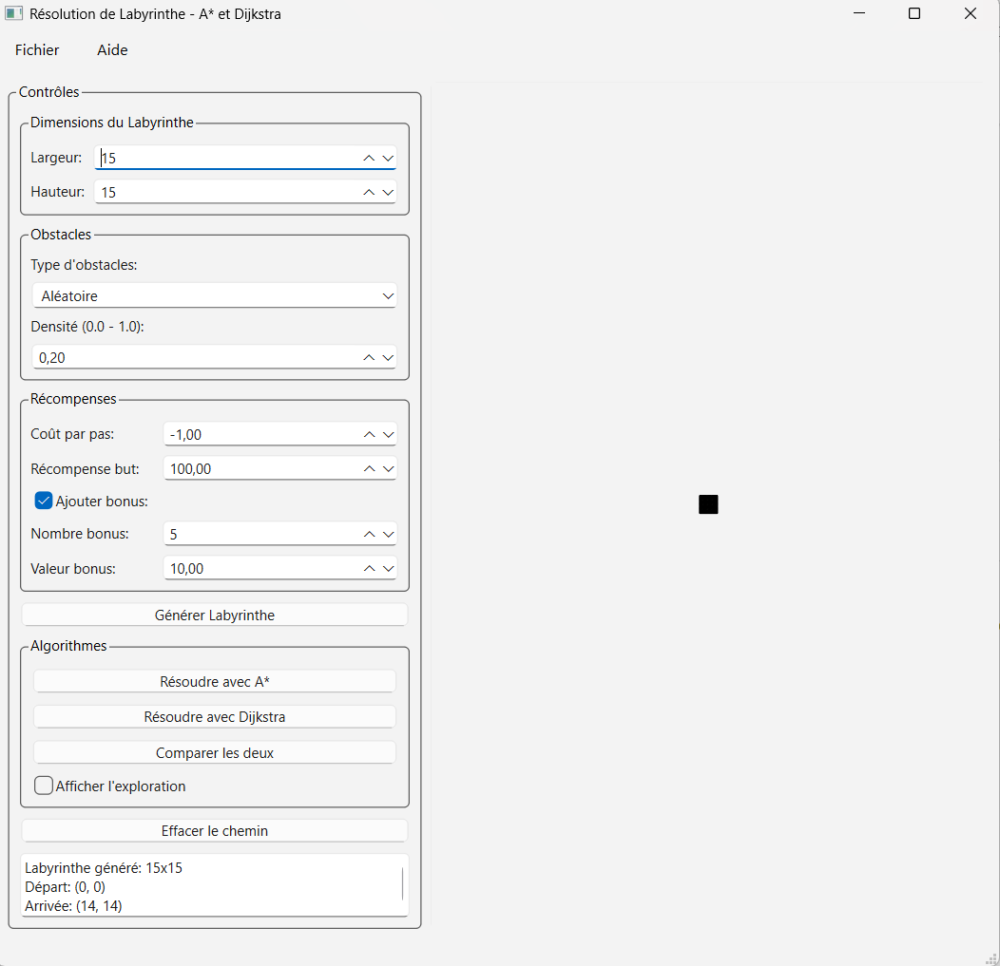
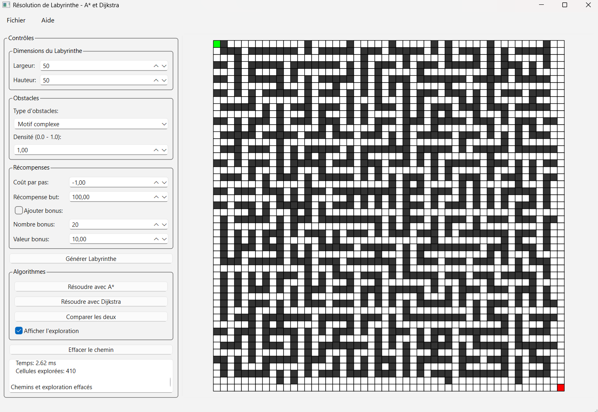
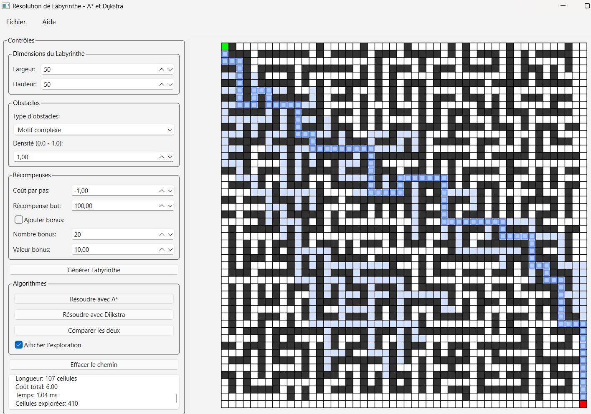
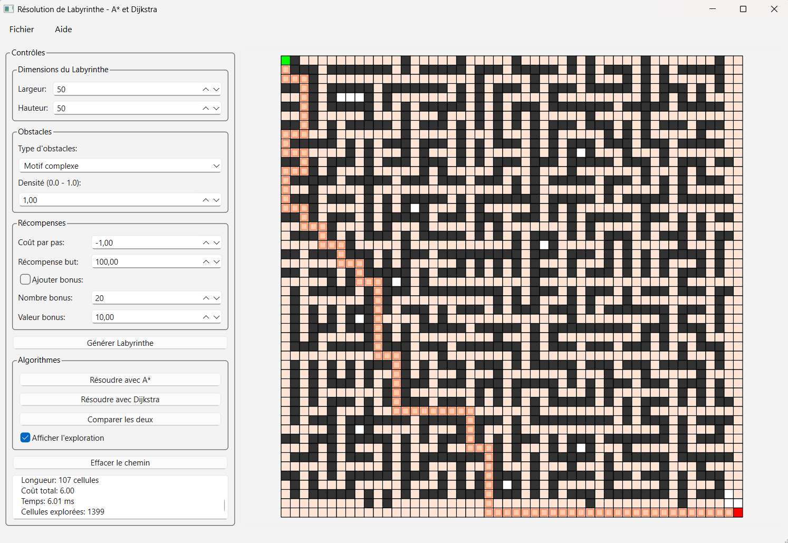
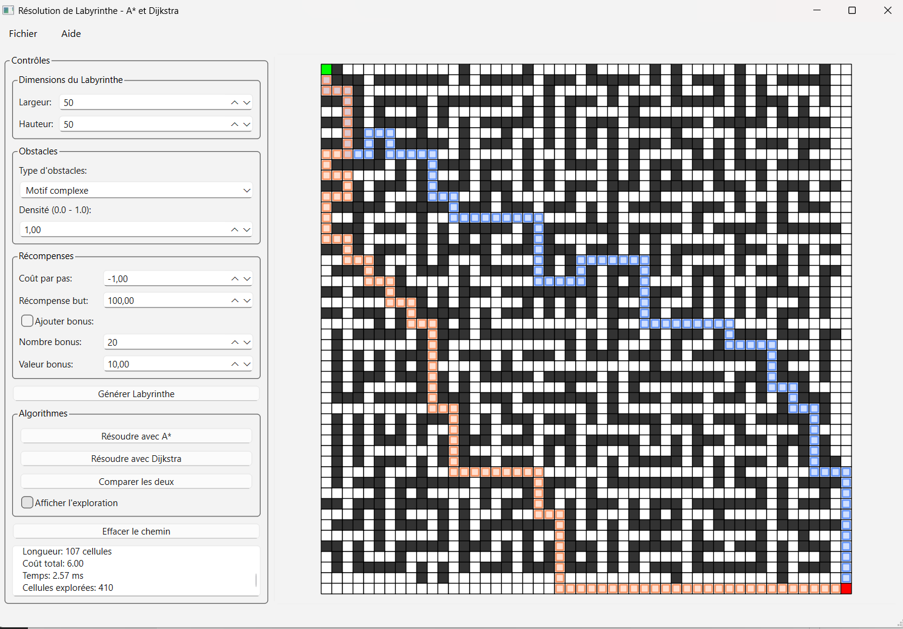
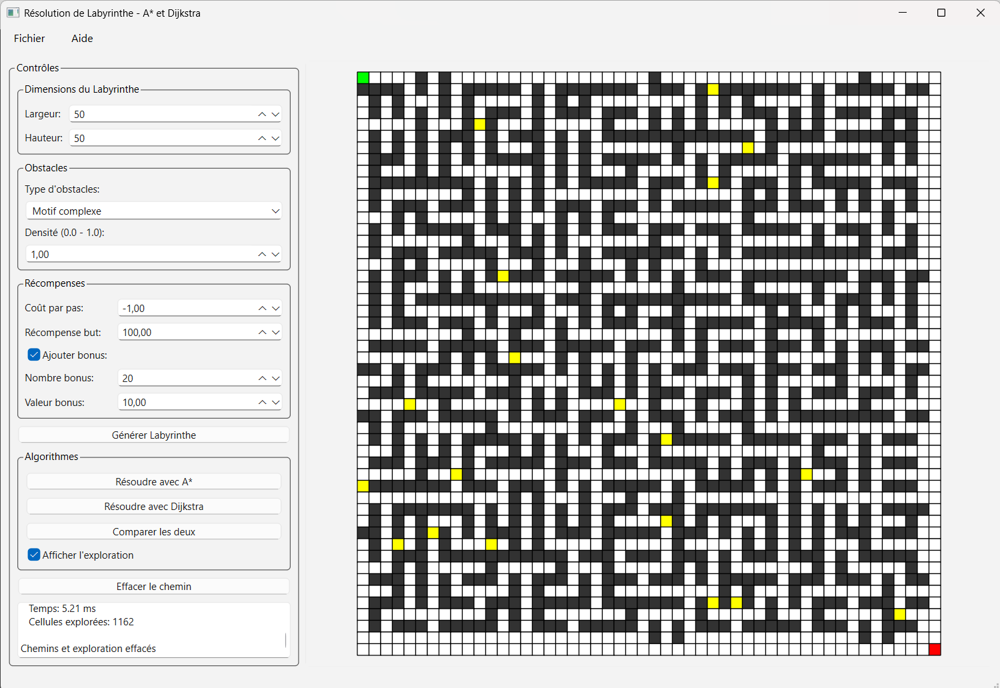
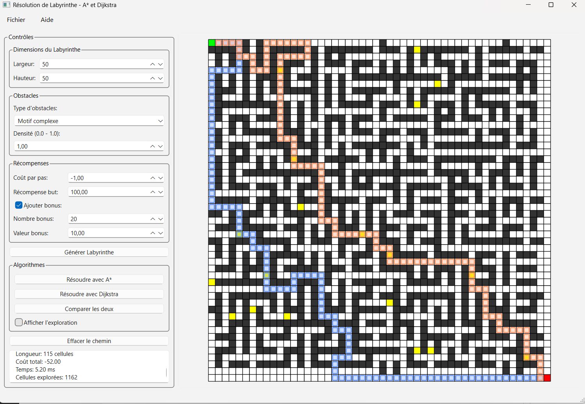

# TP1 - Robotique : Résolution de labyrinthe avec A*

Ce projet implémente les algorithmes **Dijkstra** et **A*** pour résoudre des problèmes de planification de trajectoire dans un labyrinthe en 2D.

## 📋 Contenu du projet

- `Maze.py` : Classe principale représentant un labyrinthe avec les algorithmes A* et Dijkstra
- `main.py` : Fonctions de génération de labyrinthes (obstacles, récompenses, etc.)
- `app.py` : Application graphique avec interface PySide6
- `tests.py` : Suite de tests couvrant tous les cas du TP
- `maze_window.ui` : Fichier d'interface Qt Designer
- `ui_maze_window.py` : Fichier Python généré à partir du .ui

## 🚀 Installation

### Prérequis

- Python 3.13.9 ou supérieur
- pip (gestionnaire de paquets Python)

### Dépendances

Installez les dépendances avec pip:

```bash
pip install numpy PySide6
```

### Conversion du fichier .ui (déjà fait)

Le fichier `.ui` a déjà été converti, mais si vous modifiez l'interface:

```bash
pyside6-uic maze_window.ui -o ui_maze_window.py
```

## 💻 Utilisation

### Interface graphique

Lancez l'application graphique:

```bash
python app.py
```

**Fonctionnalités:**
- Générer des labyrinthes de différentes tailles
- Choisir le type d'obstacles (aléatoire, murs verticaux/horizontaux, motif complexe)
- Configurer les récompenses et bonus
- Résoudre avec A* ou Dijkstra
- Comparer les deux algorithmes
- Visualisation colorée du labyrinthe et des chemins
- **Afficher l'exploration** : Visualiser toutes les cellules explorées par chaque algorithme

### 📸 Captures d'écran

#### Interface principale


#### Labyrinthe avec obstacles

*Labyrinthe 35x35 avec obstacles aléatoires*

#### Visualisation avec A*

*A* - Zones bleues claires montrant les cellules explorées*

#### Visualisation avec Dijkstra

*Dijkstra sur le même labyrinthe - Zones oranges claires montrant les cellules explorées*

### Comparaison des deux


#### Visualisation avec points de passage bonus (Jaune)


*A* et Dijkstra avec bonus - Cellules jaunes représentant les récompenses*

**Légende des couleurs:**
- 🟢 Vert : Point de départ
- 🔴 Rouge : Point d'arrivée
- ⬛ Noir : Obstacles
- 🟡 Jaune : Bonus (récompenses positives)
- 🔵 Bleu clair : Cellules explorées par A*
- 🟠 Orange clair : Cellules explorées par Dijkstra
- 🔵 Bleu foncé : Chemin final trouvé par A*
- 🟠 Orange foncé : Chemin final trouvé par Dijkstra

> **💡 Observation clé** : Sur les captures, on voit clairement que A* explore environ **36% moins de cellules** que Dijkstra (419 vs 654) grâce à son heuristique de Manhattan qui guide la recherche vers le but !

### Tests en ligne de commande

Exécutez la suite de tests complète:

```bash
python tests.py
```

Cette commande exécute tous les tests demandés dans le TP:
1. Labyrinthe sans obstacle
2. Labyrinthe avec obstacles simples
3. Labyrinthe sans solution
4. Labyrinthes avec poids négatifs
5. Comparaison sur grand labyrinthe
6. Réponses aux questions théoriques

### Utilisation programmatique

```python
from Maze import Maze
from main import create_complete_maze

# Créer un labyrinthe
maze = create_complete_maze(
    width=10,
    height=10,
    obstacle_type="random",
    obstacle_density=0.2,
    step_cost=-1.0,
    goal_reward=100.0
)

# Résoudre avec A*
path_astar = maze.solve()
print(f"Chemin A*: {path_astar}")

# Résoudre avec Dijkstra
path_dijkstra = maze.solve_dijkstra()
print(f"Chemin Dijkstra: {path_dijkstra}")
```

## 📊 Algorithmes implémentés

### A* (A-Star)

- Utilise une heuristique (distance de Manhattan) pour guider la recherche
- Formule : f(n) = g(n) + h(n)
  - g(n) : coût réel depuis le départ
  - h(n) : estimation du coût restant (heuristique)
- Plus rapide que Dijkstra en moyenne
- Optimal si l'heuristique est admissible

### Dijkstra

- Algorithme de plus court chemin classique
- Explore uniformément dans toutes les directions
- Garanti de trouver le chemin optimal
- Équivalent à A* avec heuristique nulle (h(n) = 0)

## 📝 Réponses aux questions du TP

### Question 5 : Différences entre Dijkstra et A*

**Performance:**
- A* est généralement 2-5x plus rapide que Dijkstra
- A* explore moins de nœuds grâce à l'heuristique
- Même complexité théorique O((V+E) log V), mais meilleure en pratique

**Utilisation:**
- Dijkstra : Aucune connaissance de la destination requise
- A* : Nécessite une heuristique admissible

### Question 6 : Quand A* = Dijkstra ?

A* est équivalent à Dijkstra quand:
1. Heuristique nulle (h(n) = 0)
2. Obstacles très nombreux forçant exploration exhaustive
3. Graphes très denses

### Question 7 : Sommets explorés avec heuristique parfaite

Si h(n) est parfaite (= coût réel restant):
- A* explore uniquement les nœuds sur le chemin optimal
- Nombre de sommets = longueur du chemin optimal
- C'est le cas idéal (impossible en pratique)

## 🎨 Structure du code

### Classe Maze

```python
class Maze:
    def __init__(self, width, height, grid=None, rewards=None, 
                 start=None, goal=None)
    
    # Méthodes principales
    def solve(self)              # A*
    def solve_dijkstra(self)     # Dijkstra
    def get_neighbors(row, col)  # Voisins 4-connexes
    def heuristic(row, col)      # Distance de Manhattan
```

### Fonctions de génération

- `generate_random_obstacles()` : Obstacles aléatoires
- `generate_deterministic_obstacles()` : Motifs prédéfinis
- `initialize_uniform_rewards()` : Matrice de récompenses
- `add_bonus_cells()` : Ajout de bonus
- `create_complete_maze()` : Création complète

## 🧪 Exemples de tests

### Test 1 : Sans obstacle
```python
maze = create_complete_maze(10, 10, obstacle_type="random", 
                           obstacle_density=0.0)
```

### Test 2 : Obstacles simples
```python
maze = create_complete_maze(10, 10, obstacle_type="vertical_walls")
```

### Test 3 : Sans solution
```python
maze = Maze(10, 10)
for j in range(maze.width):
    maze.set_obstacle(5, j)  # Mur bloquant
```

### Test 4 : Poids négatifs
```python
maze = create_complete_maze(10, 10, step_cost=-5.0, 
                           bonus_value=5.0)
```

## 📈 Résultats attendus

D'après les tests:
- ✅ Les deux algorithmes trouvent toujours le même chemin optimal
- ✅ A* est environ 1.5-3x plus rapide sur des labyrinthes moyens
- ✅ Sur grands labyrinthes (30x30+), A* montre un net avantage
- ✅ Les deux gèrent correctement les poids négatifs (pas de cycles)

## 🎯 Objectifs pédagogiques atteints

- ✅ Implémentation de Dijkstra
- ✅ Implémentation de A* avec heuristique de Manhattan
- ✅ Gestion d'obstacles et de récompenses
- ✅ Comparaison des performances
- ✅ Visualisation graphique
- ✅ Tests exhaustifs

## 📚 Références

1. De Kat. Lecture 10 : Dijkstra's Shortest Path Algorithm. Hong Kong University
2. Siyang Chen. The A* Search Algorithm. [Duke University]


## 📄 Licence

Projet académique - TP de Robotique
